# StudyForge — Document 2: Comprehensive Prompt Dependency Map

## End-to-End Prompt Chains, Decision Gates, Data Lineage, User Control, and Failure Routes

**Companion to:** Document 1 — Comprehensive AI Usage and Prompt Architecture  
**Purpose:** Show exactly how every prompt, function, output, user decision, and later prompt depends on the previous one. This document is a dependency map, not a template library.

\---

# 1\. How to Read This Map

## 1.1 Node legend

|Symbol|Meaning|
|-|-|
|`\[UI]`|User interface action or visible screen state|
|`\[SYS]`|Deterministic application logic; no AI call|
|`\[AI-ID]`|One AI operation defined in Document 1|
|`{DATA}`|Persisted data object/state|
|`◇`|Decision gate|
|`↻`|Retry / feedback / regeneration loop|
|`→`|Data/control moves forward|
|`⇢`|A prompt output is injected into another prompt|

## 1.2 Core flow rule

No downstream prompt should recreate or guess information that a prior prompt already produced in structured form. Instead it must consume the saved output through its stable IDs.

```text
Source → Signals → Structured Analysis → Parts → Blueprints → Generated Assets
       → User overrides stay attached to each object at every later stage.
```

## 1.3 Primary persistent lineage

```text
{inputProfile}
      ↓
{sourceDocument + pageMap + sourceChunks}
      ↓
{subjectSignals} + {deepAnalysis} + {bundleAnalysis}
      ↓
{partPlan\[]}
      ↓
{blueprint\[partId]}
      ↓
{generatedPart\[partId]} + {imageAssets\[]} + {currentAffairsResults\[]}
      ↓
{approvalState}
      ↓
{approvedDocument}
      ↓
Export (no AI)
```

\---

# 2\. Master Dependency Graph

```mermaid
flowchart TD
    I\[UI: Screen 1 Input] --> M{Input method?}

    M -->|File upload| R1\[SYS: Technical extraction / OCR]
    R1 --> Q1{Extraction usable?}
    Q1 -->|Yes| S0\[(sourceDocument)]
    Q1 -->|No| A02A\[AI-02A Cleanup]
    A02A --> Q2{Cleanup usable?}
    Q2 -->|Yes| S0
    Q2 -->|No| A02B\[AI-02B Restructure]
    A02B --> S0

    M -->|Paste text| S0

    M -->|Topic / AI Draft| A01A\[AI-01A Expand sub-topics]
    A01A --> U1\[UI: User edits/approves scope]
    U1 --> A01B\[AI-01B Draft source material]
    A01B --> U2\[UI: Method 3 user edits source]
    U2 --> S0

    S0 --> C0\[SYS: Semantic chunk decision]
    C0 --> A03A\[AI-03A Subject \& signal detection]
    A03A --> SIG\[(subjectSignals)]
    SIG --> A03B\[AI-03B Deep extraction]
    A03B --> DA\[(deepAnalysis)]
    SIG --> RT\[SYS: Signal-to-bundle routing]
    DA --> A03C\[AI-03C Smart bundle analysis]
    RT --> A03C
    A03C --> BA\[(bundleAnalysis)]
    BA --> U3\[UI: Screen 3 auto-on / suggested / force-enable]
    U3 --> BO\[(userBundleOverrides)]
    U3 -->|Force-enable| A03D\[AI-03D Requested bundle analysis]
    A03D --> BA

    DA --> A04\[AI-04 Part splitting]
    BA --> A04
    BO --> A04
    A04 --> PP\[(partPlan)]
    PP --> U4\[UI: Screen 4 edit/add/merge/remove/bundles]
    U4 --> PP

    PP --> A05\[AI-05 Blueprint per part, staggered parallel]
    DA --> A05
    BA --> A05
    A05 --> BP\[(blueprint per part)]
    BP --> U5\[UI: Screen 5 cards / Screen 6 detail]
    U5 -->|Chat edit| A06A\[AI-06A Surgical blueprint change]
    A06A --> BP
    U5 -->|Regenerate one section| A06B\[AI-06B Section-only regeneration]
    A06B --> BP

    BP --> U6\[UI: Generate Part / Auto-Generate]
    PP --> A07A\[AI-07A Text generation]
    DA --> A07A
    A07A --> GP\[(generatedPart)]
    GP --> IMG0{Image requested?}
    BP --> IMG0
    IMG0 -->|Yes| A07B\[AI-07B Expand image prompt]
    A07B --> A07C\[AI-07C Generate image]
    A07C --> IA\[(imageAssets)]
    IA --> GP

    BP --> CA0{Fetch CA or Auto-Generate?}
    CA0 -->|Yes| A07D\[AI-07D Grounded CA]
    A07D --> CA\[(currentAffairsResults)]
    CA --> GP

    GP --> A07E\[AI-07E Optional post-text image gap review]
    A07E --> IMG0
    U6 -->|Highlight \& Visualize| A07F\[AI-07F Visualize selected text]
    A07F --> A07C
    U6 -->|Refine| A07G\[AI-07G Scope-aware refinement]
    A07G --> GP

    GP --> U7\[UI: Approve Part]
    U7 --> A07H\[AI-07H Per-part validation]
    A07H --> V1{User validation decision}
    V1 -->|Cancel| GP
    V1 -->|Ignore and approve| AP\[(approved part)]
    V1 -->|Apply modification| MOD{Modification type?}
    MOD -->|Text / container| A07G
    MOD -->|Regenerate content| A07A
    MOD -->|Suggested image| A07K\[AI-07K Image request from validation]
    A07K --> A07B
    A07G --> AP

    AP --> ALL{All remaining parts approved?}
    ALL -->|No| U6
    ALL -->|Yes| A07I\[AI-07I Final consolidated validation]
    A07I --> V2{User final decision}
    V2 -->|Skip| EX\[Screen 8 Export: no AI]
    V2 -->|Enrich existing part| A07G
    V2 -->|Add suggested part| A07J\[AI-07J Quick blueprint]
    A07J --> BP
    A07G --> ALL
```



> \*\*Implementation note:\*\* Mermaid is a documentation aid. The application must implement this as actual state transitions and functions—not as a visual-only diagram.

\---

# 3\. Stage 1 Dependency Maps

## 3.1 Input-method decision map

```text
\[Screen 1]
   │
   ├── Upload file
   │     └── \[SYS: technical read] → sourceDocument → Stage 3
   │                  └── only on failure → AI-02A → possibly AI-02B
   │
   ├── Paste text
   │     └── sourceDocument (as-is) → Stage 3
   │
   └── Topic + optional sub-topics
         └── \[AI-01A] → user review gate → \[AI-01B] → Method 3 edit gate
                                                      └── sourceDocument → Stage 3
```

## 3.2 AI Draft Text chain: detailed lineage

|Step|Upstream data / actor|Creates|Dependency rule|Downstream consumer|
|-:|-|-|-|-|
|1|User|`inputProfile.topic`, `inputProfile.userSubtopics`, depth, internet/current flags|Raw user values must remain separately saved; never overwrite them with AI suggestions.|AI-01A|
|2|Prompt Builder|Final AI-01A prompt|Uses user topic/sub-topics plus selected depth/context. Grounding enabled only if Method 2 internet mode is enabled.|AI-01A|
|3|AI-01A|`subtopicExpansion`|Guaranteed topics = user topics. Suggested topics must have reason and essential/optional status.|Screen 1 scope editor|
|4|User|`approvedSubtopics\[]`|User can delete AI suggestions or add own topics. The approved array—not raw AI result—is canonical.|AI-01B|
|5|Prompt Builder|Final AI-01B prompt|Uses topic + approved sub-topics + depth + current/internet settings.|AI-01B|
|6|AI-01B|Source-like full study text, headings, web metadata if search used|Output is draft material, not final Screen 7 notes.|Method 3 editor|
|7|User|Final edited source text|User editing has final authority.|`sourceDocument`|
|8|SYS|Canonical `sourceDocument`|Origin labeled `ai\_draft`; source content is current editor text.|AI-03A / AI-03B|

## 3.3 Stage 1 gates

|Gate|Question|Yes route|No route|
|-|-|-|-|
|G-01|Is Method 2 selected?|AI-01A starts|Use upload/paste route|
|G-02|Did user approve an expanded scope?|AI-01B starts|User edits or cancels; no content generation|
|G-03|Did user enable internet/current mode?|AI-01A/AI-01B use grounding and retain web source metadata|Both calls run without grounding|
|G-04|Did user click Continue after reviewing draft?|Canonical source goes to Stage 3|Remain in editable Method 3 area|

\---

# 4\. Stage 2 Dependency Maps — Reading, Fallback, Chunking

## 4.1 Extraction failure chain

```text
\[Technical extraction]
      │
      ├── usable source text + page map
      │       └── {sourceDocument} → Stage 3
      │
      └── poor/garbled/incomplete extraction
              └── AI-02A cleanup
                     │
                     ├── quality acceptable → {clean sourceDocument} → Stage 3
                     └── still inadequate → AI-02B restructure
                                              └── {structured sourceDocument} → Stage 3
```

## 4.2 Source preservation dependencies

|Data from reading|Must be preserved into|Why it matters later|
|-|-|-|
|Original file metadata|input/profile + export metadata|Lets UI identify original source and trace origin.|
|Page number/page boundaries|Deep analysis, source tags, slicing, validation|Enables `SOURCE\_BACKED` page references and part slicing.|
|Extracted images/diagram references|Deep analysis and image decisions|Allows AI to know visual material exists without silently discarding it.|
|Unresolved/uncertain source sections|Analysis and validation|AI must not fabricate content where extraction was uncertain.|
|Source origin (upload/paste/AI draft)|Traceability state|Source-backed is relative to canonical source, regardless of origin.|

## 4.3 Chunking dependency map

```text
{sourceDocument.text + pageMap}
            ↓
\[SYS: estimate token count]
            ↓
     ◇ fits safe context threshold?
        ├── Yes → AI-03A / AI-03B with whole source
        └── No  → \[SYS: semantic chunker]
                    ↓
              {sourceChunks\[] + continuity metadata}
                    ↓
              AI-03A / AI-03B per chunk
                    ↓
              \[SYS: structured merge + dedupe]
                    ↓
              {global subjectSignals + deepAnalysis}
                    ↓
              AI-03C and Stage 4
```

### Chunk merge rules

|Item|Merge operation|Prohibited behavior|
|-|-|-|
|Topics|Merge by semantic similarity and page range; retain multiple references|Do not discard a topic only because it appears in another chunk.|
|Definitions|Deduplicate exact/near-exact definitions; preserve all page refs|Do not merge distinct terms merely because wording is similar.|
|Formulas|Deduplicate by normalized mathematical expression; retain variable notes/source refs|Do not lose formula variants or conditions.|
|PYQs|Preserve each question/year/type; deduplicate only exact repeated entries|Do not collapse same-topic but distinct PYQs.|
|Timeline events|Sort/merge chronologically with source refs|Do not invent missing dates.|
|Tables/diagrams|Keep location and structural notes|Do not treat image-only material as empty content.|

\---

# 5\. Stage 3 Dependency Maps — Understanding, Extraction, Bundles

## 5.1 The three-call hybrid chain

```text
{canonical source}
   ↓
AI-03A Subject + signal detection
   ↓                         ↘
{subjectSignals}               \[SYS: deterministic signal-to-bundle router]
   ↓                                                   ↓
AI-03B Deep extraction                         routed bundle IDs + evidence
   ↓                                                   ↓
{deepAnalysis} ─────────────────────────────────────→ AI-03C Smart bundle analysis
                                                          ↓
                                                    {bundleAnalysis}
                                                          ↓
                                            \[UI: auto-on / suggested / force-enable]
                                                          ↓
                                               {userBundleOverrides + final bundles}
```

## 5.2 Why AI-03A must finish before AI-03B and AI-03C

|Dependency|Reason|
|-|-|
|AI-03A → AI-03B|The deep-extraction instruction becomes more accurate when it knows primary subject/sub-discipline and evidence signals.|
|AI-03A → router → AI-03C|Routing irrelevant bundles must happen before bundle prompt composition; otherwise the app wastes cost and asks AI to hallucinate features.|
|AI-03B → AI-03C|Bundle detection should use known formulas, tables, examples, locations, etc., not merely raw text signals.|
|AI-03C → Screen 3|Three-tier feature UI needs evidence/reasons and state (auto/suggested/not detected).|

## 5.3 Rule-based router map

```text
subjectSignals + deepAnalysis
       ↓
\[SYS: routeBundleSignals()]
       ↓
  formula present? ────── yes → Formula Operations / Maths
  locations present? ──── yes → Geography / Maps
  persons present? ────── yes → Personality
  dates/historical cues?  yes → Timeline / Historical
  legal references? ───── yes → Legal / Constitutional
  code/algorithm? ─────── yes → CS / Algorithm / I-O
  charts/data/tables? ─── yes → Data / Chart / Comparison
  processes? ──────────── yes → Process / Creation
  current cues? ───────── yes → CA planning
  abstract/difficult concept? → Storytelling/Analogy suggested
       ↓
{routedBundleIds}
       ↓
AI-03C combined relevant-bundles prompt (MVP)
```

## 5.4 Force-enable loop

```text
Screen 3 shows grey/not-detected bundle
      ↓
User force-enables bundle or feature
      ↓
AI-03D receives only selected bundle + relevant source/analysis
      ↓
{bundle-specific analysis}
      ↓
Update Screen 3 feature options and global selected bundle state
      ↓
Stage 4 and Stage 5 consume updated selection
```

## 5.5 Screen 3 output dependencies

|Screen 3 element|Source of truth|Consumed later by|
|-|-|-|
|Subject / sub-discipline|`subjectSignals`|Blueprint strategy and writing context|
|Basic counts: topics/definitions/formulas/PYQs/etc.|`deepAnalysis`|Screen 4, Screen 5, Screen 7|
|Green/yellow/grey bundle UI|`bundleAnalysis` + user overrides|Stage 4 part assignments|
|Evidence tooltip|AI-03A/AI-03C evidence arrays|User trust and audit only; must be retained|
|Force-enabled bundle results|AI-03D|Per-part bundle planning and generation|

\---

# 6\. Stage 4 Dependency Map — Splitting into Parts

## 6.1 Inputs that form the splitting prompt

```text
{deepAnalysis}
     +
{selected global bundle features}
     +
{page count / source length}
     +
{whole source if safe OR topic summaries if large}
     +
{splitting guardrails}
     ↓
\[Prompt Builder: AI-04]
     ↓
AI-04 proposes parts + per-part bundles
     ↓
{partPlan\[]}
```

## 6.2 Guardrail vs coherence decision map

```text
AI calculates recommended range from page/length table
              ↓
AI groups topics by conceptual dependency
              ↓
Check constraints:
 - formula stays with explanation?
 - PYQ remains with tested topic?
 - related concepts together?
 - tiny part avoided?
              ↓
◇ proposed count inside table range?
  ├── Yes → normal part proposal
  └── No  → proposal + visible warning + user decision
```

## 6.3 Per-part bundle inheritance algorithm

```text
Global user-enabled bundle
       ↓
Does Part P contain evidence relevant to the bundle?
       ├── Yes → include bundle in P.applied\_bundles
       └── No  → do not apply by default
                     ↓
               user may add/remove bundle chip in Screen 5/6
```

## 6.4 Manual changes and re-dependency rules

|User action on Screen 4|State update|Required downstream action|
|-|-|-|
|Rename part|Update `partPlan\[partId].title`|Existing blueprint becomes stale if title/scope changed materially; mark for re-blueprint or update it.|
|Change page range|Update source scope + assigned analysis refs|Blueprint must be regenerated for affected part; potentially adjacent part too.|
|Add part|Create stable part ID and inherited eligible bundles|Call AI-05 for new part; never drop bundle data.|
|Remove part|Remove/mark deleted from plan|Remove its blueprint/generated data or archive; final validation excludes it.|
|Merge parts|Combine source/analysis/bundles|Generate a new coherent blueprint for merged part.|
|Change applied bundles|Update part-level override|Regenerate/update only affected blueprint sections, then future generation uses new set.|

\---

# 7\. Stage 5–6 Dependency Map — Blueprint Generation and Modification

## 7.1 Parallel blueprint fan-out / fan-in

```text
{confirmed partPlan\[]}
          ↓
\[SYS: create one AI-05 job per part]
          ↓
   P-01 ──AI-05──→ blueprint\[P-01]
   P-02 ──AI-05──→ blueprint\[P-02]
   P-03 ──AI-05──→ blueprint\[P-03]
   P-04 ──AI-05──→ blueprint\[P-04]
          ↓
Jobs start in staggered parallel sequence (\~1 second gap)
          ↓
\[SYS: collect successes and isolated failures]
          ↓
Screen 5 blueprint card grid
```

### Fan-out rules

|Rule|Required behavior|
|-|-|
|Unique context|Each prompt receives only its own part scope plus global definitions/formulas.|
|Failure isolation|P-03 failure must not reset P-01/P-02/P-04 outputs.|
|Prompt visibility|Each card shows its own exact final prompt, not a generic sample.|
|Progress|UI identifies every part as queued/generating/ready/failed/retrying.|
|Rate limits|Use staggered launch and retry only the failed operation.|

## 7.2 Blueprint internal dependency map

```text
AI-05 single coherent output
    ├── headings
    ├── text\_plan
    │      └── controls AI-07A container/content request
    ├── image\_plan
    │      └── controls AI-07B image prompt expansion
    ├── ca\_plan
    │      └── controls AI-07D grounded query execution later
    └── validation\_plan
           └── controls/checks AI-07H per-part validation
```

No plan section should be generated in isolation initially because image/CA/validation plans need to know the selected text plan and headings.

## 7.3 Screen 6 modification loop

```text
\[Screen 6 current blueprint]
        ↓
User: “Add more formulas” / “Make Image 2 a flowchart”
        ↓
AI-06A scope detection + patch proposal
        ↓
◇ Targeted patch valid?
  ├── Yes → update only impacted blueprint section → store undo payload
  └── No / user requests section regeneration → AI-06B
                                                  ↓
                                           replace target section only
        ↓
Updated blueprint becomes active input for generation
```

## 7.4 Blueprint stale-state matrix

|Change occurs after blueprint exists|Is blueprint stale?|Required response|
|-|-:|-|
|User changes part title only|Usually no, unless title changes meaning|Update presentation; optionally prompt update.|
|User changes source range/topics|Yes|Rebuild full blueprint for that part.|
|User changes only image style|Only image plan item stale|Use AI-06A/AI-06B Image Plan only.|
|User adds Formula bundle|Text plan and validation plan may be stale|Targeted update; preserve unrelated plan sections.|
|User changes CA query|Only CA plan stale|Update query; no full blueprint regeneration.|
|Generated part already exists and blueprint is edited|Generated content may be stale|Warn user and offer targeted regenerate; do not silently overwrite manual edits.|

\---

# 8\. Stage 7 Dependency Map — Generation Orchestration

## 8.1 Per-part generation context assembly

```text
{partPlan\[P]}
    + {source slice for P}
    + {part-specific topics/PYQs/examples/tables/etc.}
    + {ALL definitions}
    + {ALL formulas}
    + {blueprint\[P]}
    + {applied bundles for P}
    + {optional CA results already fetched}
    ↓
\[SYS: buildPartGenerationContext(P)]
    ↓
AI-07A
    ↓
{generatedPart\[P] with safe content blocks + image-needed markers}
```

## 8.2 Why all definitions and formulas pass to each part

```text
Part-specific source slice is strict
         ↓
But definitions/formulas may be referenced across part boundaries
         ↓
Include compact complete definitions/formulas registry
         ↓
Writer can reference a cross-part item without inventing it
```

Other potentially large objects—PYQs, examples, comparisons, timelines, raw paragraphs—remain limited to relevant part scope unless specifically referenced.

## 8.3 Text-to-image chain

```text
AI-07A returns image\_needed\[]
  OR blueprint\[P].image\_plan already has pending items
  OR AI-07E finds a visual gap
  OR AI-07H validation accepts visual suggestion
            ↓
\[SYS: normalize image request]
            ↓
\[SYS: reserve safe insertion anchor in generated HTML]
            ↓
AI-07B expands prompt using local content + learning objective
            ↓
◇ Preview image prompts setting on?
  ├── Yes → UI user reviews/edits/approves prompt → AI-07C
  └── No  → AI-07C starts immediately
            ↓
{imageAsset}
            ↓
\[SYS: attach image to reserved anchor]
            ↓
{generatedPart\[P] updated + imageAssets\[]}
```

## 8.4 Current-affairs chain

```text
blueprint\[P].ca\_plan.queries\[]
             ↓
◇ User clicked Fetch CA OR Auto-Generate requires it?
  ├── No → retain editable plan; no search cost
  └── Yes → AI-07D with grounding ON
                  ↓
             {CA facts + URLs + dates + fetch time}
                  ↓
             \[SYS: WEB\_SOURCED renderer]
                  ↓
             part CA container / optional targeted text update
```

## 8.5 Dynamic image discovery at all agreed moments

|Moment|Trigger source|What it produces|Next dependency|
|-|-|-|-|
|During writing|AI-07A returns `image\_needed` marker|Description + exact anchor|AI-07B → AI-07C|
|After writing|AI-07E reviews completed part|Missing-image suggestion + anchor|User/system accepts → AI-07B → AI-07C|
|During validation|AI-07H finds a visual gap|Suggested image with target location|User accepts → AI-07K → AI-07B → AI-07C|

## 8.6 Highlight-to-visualize chain

```text
\[User highlights text]
        ↓
\[SYS: collect selection + parent/neighbor paragraphs + part metadata]
        ↓
AI-07F returns detailed prompt + 3 styles/reasons
        ↓
\[UI: user chooses/edit prompt/style]
        ↓
AI-07C generates visual
        ↓
\[SYS: insert at selection/paragraph anchor]
```

## 8.7 Refinement chain and manual-edit protection

```text
User natural-language instruction
        ↓
AI-07G identifies scope
        ↓
◇ scope = local containers or whole part?
  ├── local → return before/after patch diff → user selects patches → update only anchors
  └── whole → show warning about manual edits/cost → user confirms → controlled regeneration
```

|User phrase example|Expected detected scope|
|-|-|
|“Make the formula explanation simpler”|Formula containers only|
|“Add a comparison between the three methods”|Relevant comparison area/container|
|“Change the Shyam comic to a flowchart”|Image plan/image asset only|
|“Make the entire part easier for a beginner”|Whole part; confirmation required|
|“Add current facts for GDP”|CA container or CA query flow; grounding remains restricted to AI-07D|

\---

# 9\. Stage 7 Dependency Map — Approval and Validation

## 9.1 Per-part validation input graph

```text
{generatedPart\[P]}
    + {imageAssets attached to P + descriptions}
    + {CA results for P}
    + {source slice for P}
    + {blueprint\[P] + validation plan}
    + {traceability map}
             ↓
          AI-07H
             ↓
{summary + issues + suggestions + image suggestions}
             ↓
       \[Validation popup]
```

## 9.2 Per-part validation decision routes

|User choice|Immediate dependency|Resulting state|
|-|-|-|
|Cancel|None|Part remains draft/unapproved.|
|Ignore \& Approve As-Is|Approval state writer|Text, images, CA become approved together.|
|Approve Modifications: text/container|AI-07G or AI-07A depending on scope|Modified part re-rendered, then marked approved after applying accepted changes.|
|Approve Modifications: image|AI-07K → AI-07B → AI-07C|Image inserted/replaced, then part approved.|
|Approve Modifications: CA|AI-07D if fresh data is needed|WEB\_SOURCED update inserted, then part approved.|

## 9.3 Consolidated validation input graph

```text
{approved part P-01} + {approved P-02} + ... + {approved P-n}
          ↓
\[SYS: build coverage map from blueprints, bundles, tags, and content]
          ↓
AI-07I
          ↓
{coverage strengths + gaps + add/enrich suggestions}
          ↓
\[Final validation popup]
```

## 9.4 Final suggestion routes

```text
AI-07I suggestion
       ↓
◇ suggestion type?
   ├── Add a part → user accepts → AI-07J quick blueprint → AI-07A → AI-07H → AI-07I again
   ├── Enrich existing part → user accepts → AI-07G / AI-07A → AI-07H → AI-07I again
   ├── Add an image → user accepts → AI-07K → AI-07B → AI-07C → part validation if required
   ├── Add container/table/timeline → user accepts → AI-07G → part validation if required
   └── Skip → final document remains as approved → Screen 8
```

\---

# 10\. Stage 8 Dependency Map — Export Without AI

```text
{approved part HTML}
   + {approved images}
   + {approved current-affairs blocks}
   + {traceability tags + citations}
   + {document metadata}
        ↓
\[SYS: compile formatted final document]
        ↓
◇ User export choice?
   ├── Copy formatted text + images
   └── Save/print as PDF
```

No prompt is generated in this stage. Export must not call AI, revalidate, or silently alter approved content.

\---

# 11\. Prompt Data Lineage Table

This table identifies where each critical data type is first created and every stage that may consume it.

|Data type|First creator|Updated by|Consumed by|
|-|-|-|-|
|User main topic|Screen 1 user|User only|AI-01A, AI-01B, AI-03A, AI-04, AI-05, AI-07I, export metadata|
|User sub-topics|Screen 1 user|AI-01A suggests; user approves/edits|AI-01B, source analysis indirectly|
|Canonical source|Upload/parser, paste user, or AI-01B + user edit|AI-02A/02B only on fallback; user edit always wins|AI-03A/B/C/D, AI-04, AI-05, AI-07A/H|
|Page map|Reader/parser or AI-02 fallbacks|Semantic chunker retains mapping|AI-03A/B, AI-04, AI-05, AI-07A/H|
|Subject/sub-discipline|AI-03A|None except re-analysis|AI-03B/C, blueprint strategy, generation context, validation context|
|Signals/evidence|AI-03A|Re-analysis only|Router, AI-03C/D, Screen 3 evidence UI|
|Definitions/formulas|AI-03B|Structured merge/dedupe|AI-04, AI-05, **every AI-07A call**, validation|
|PYQs/examples/timelines/tables|AI-03B|Structured merge/dedupe|AI-04, relevant blueprints, relevant part generation/validation|
|Global bundle selection|AI-03C/D + user|User override|AI-04, AI-05, AI-07A, AI-07I|
|Per-part bundles|AI-04|User Screen 5/6 override|AI-05, AI-07A, validation|
|Part plan|AI-04|User Screen 4/add-part flow|AI-05, AI-07A, navigation/progress/export sequence|
|Blueprint|AI-05|AI-06A/B + user action|AI-07A/B/D/H/I|
|Generated text|AI-07A|AI-07G/refinement|AI-07E/H/I, export|
|Image prompt|AI-07B/AI-07F/user edit|User prompt edit/regeneration|AI-07C, validation prompt history|
|Image assets|AI-07C|Replacement/regeneration|generated part, AI-07H/I, export|
|CA results|AI-07D|Refresh/re-fetch|generated part, AI-07H/I, export|
|Part approval|User after AI-07H decision|User actions/removal|AI-07I and export|

\---

# 12\. Invalidation and Recalculation Map

A dependency map is incomplete unless it states what becomes stale after a user changes something.

|Changed item|Invalidate / mark stale|Do not unnecessarily invalidate|
|-|-|-|
|Source text changes before Stage 3|All prior analysis/parts/blueprints if any|None; source change is foundational|
|Global bundle changes on Screen 3|Per-part bundle assignment and blueprints not yet generated|Core deep analysis remains valid|
|One part’s page range/topics changes|That part’s blueprint and generated output; adjacent part if range overlaps|Other independent parts|
|One part’s bundle chips change|That part’s blueprint sections affected by bundle, future generated output|Other parts and original deep analysis|
|One blueprint image-plan item changes|That image prompt/image asset for the part|Text plan unless image change affects it explicitly|
|One blueprint text-plan item changes|That part’s generated text and dependent image anchors|Other parts|
|Generated local text refined|That part’s validation status should return to draft/review as appropriate|Other parts|
|Generated image replaced|That part’s validation summary is stale|Text and unrelated parts|
|CA refreshed|CA container and validation summary for affected part|Source-backed text and other parts|
|A part is removed|Final coverage map and final validation|Other parts’ own content|
|A new part is added|Final coverage map; approval completeness|Existing approved parts remain approved unless user changes them|

\---

# 13\. Failure, Retry, and Fallback Dependency Map

## 13.1 Universal failure route

```text
Any AI operation fails
       ↓
\[SYS: classify error]
       ↓
◇ error category?
   ├── token/context/limit → construct simplified prompt → offer highlighted simplified retry
   ├── rate limit → wait \~30 seconds → retry
   ├── network → retry when connection returns / show retry state
   └── other → preserve error and prompt
       ↓
\[UI: failed prompt modal]
       ├── Retry As-Is → same operation, same context
       ├── Retry Simplified → same operation, reduced optional context
       ├── Retry Edited Prompt → user edit → rebuilt final prompt
       ├── Skip → mark only this operation/asset skipped; do not destroy unrelated work
       └── Cancel → return to prior state
```

## 13.2 Simplification priority order

When reducing an overlong prompt, the system must preserve source-critical inputs first.

|Keep first|Trim/reduce first|
|-|-|
|Task instructions and output contract|Duplicate narrative instructions|
|Current part source slice|Optional explanatory context|
|Part blueprint|Non-essential long examples|
|Part-specific analysis|Repeated evidence strings|
|All definitions/formulas for cross-part references|Optional style catalog detail not chosen by user|
|User’s edited prompt text|Older/non-active prompt history|

## 13.3 Isolated retry rules

|Failed operation|Retry scope|
|-|-|
|One AI-03C bundle result|Retry only that bundle/routed fragment|
|One AI-05 blueprint part|Retry only that part blueprint|
|One AI-07A generated part|Retry only that part|
|One image generation|Retry only image prompt/image asset; do not regenerate full text|
|One CA query|Retry that query or mark CA unavailable; do not block main notes|
|One validation call|Keep part draft; retry only validation|

\---

# 14\. Developer Verification Paths

Each path below should be manually testable from input to saved output. A feature is not complete if a UI control exists but any arrow in its path is absent.

## 14.1 Test path: Method 2 AI Draft

```text
Topic + subtopics → AI-01A prompt viewer → user checkbox edits → AI-01B final prompt
→ Method 3 text is filled → user edit persists → Stage 3 uses edited text
```

## 14.2 Test path: Force-enable bundle

```text
Grey bundle on Screen 3 → user enables → AI-03D prompt shown → bundle output saved
→ Screen 4 part assignment includes eligible bundle → Screen 5 card shows chip
→ Screen 7 generation receives applied bundle → relevant container appears
```

## 14.3 Test path: Formula across parts

```text
F-003 extracted on page 15 → stored in global formula registry
→ Part 2 generation includes all formulas including F-003
→ Part 2 can correctly reference F-003 without copying raw Part 3 text
```

## 14.4 Test path: Blueprint image to placed image

```text
AI-05 image plan → Screen 6 user changes style → updated blueprint
→ Screen 7 generate part → AI-07B final image prompt visible
→ AI-07C asset generated → inserted at defined anchor → included in AI-07H validation and PDF export
```

## 14.5 Test path: Validation-added visual

```text
Approve Part → AI-07H suggests image and anchor → user approves modification
→ AI-07K normalized request → AI-07B prompt → AI-07C image
→ image inserted after specified text → part gets approved
```

## 14.6 Test path: Final-validation added part

```text
All parts approved → AI-07I suggests Add Part 7 → user accepts
→ AI-07J quick blueprint → configure or generate immediately → AI-07A notes
→ AI-07H part validation → final AI-07I reruns → export
```

\---

# 15\. Dependency Map Completion Checklist

* \[ ] There is exactly one canonical source object after Screen 1/2 user edits.
* \[ ] AI-03A output determines routing and informs AI-03B; it is not a decorative label.
* \[ ] AI-03B creates stable IDs used by later stages.
* \[ ] AI-03C runs only relevant bundle instructions; AI-03D handles user force-enable separately.
* \[ ] AI-04 creates per-part bundle assignments, not just visual bundle icons.
* \[ ] AI-05 produces five connected blueprint sections per part.
* \[ ] Screen 6 updates only targeted blueprint data and preserves unrelated sections.
* \[ ] AI-07A uses the correct source slice plus all definitions/formulas.
* \[ ] Every image trigger uses the same insertion chain and stable anchor.
* \[ ] Grounding is used only for Method 2 when requested and for AI-07D CA research.
* \[ ] Per-part validation receives text, images, CA, source, blueprint, and traceability information together.
* \[ ] Final validation runs only after all remaining parts are approved and loops after accepted additions.
* \[ ] Export consumes approved state only and invokes no AI.
* \[ ] Every AI node has prompt history, visible prompt support, retry behavior, and isolated-failure handling.

\---

\# DOCUMENT 2: PROMPT DEPENDENCY MAP


\*\*StudyForge — How Each AI Prompt Feeds Into the Next\*\*


\---


\## PART A — VISUAL FLOW DIAGRAM (End-to-End)


```

════════════════════════════════════════════════════════════════════

&#x20;                       STAGE 1: INPUT

════════════════════════════════════════════════════════════════════


&#x20; ┌─────────────────────────────────────────────────────────────┐

&#x20; │  METHOD 1: File Upload         METHOD 3: Paste Text         │

&#x20; │  (NO AI — technical            (NO AI — as-is)              │

&#x20; │   extraction)                                                │

&#x20; │                                                              │

&#x20; │  METHOD 2: Topic + Sub-topics                                │

&#x20; │       │                                                      │

&#x20; │       ▼                                                      │

&#x20; │  ┌──────────────────────────┐                                │

&#x20; │  │ 1.1 Sub-Topic Expansion  │  Input: user topic + sub-topics│

&#x20; │  │                          │         + internet toggle       │

&#x20; │  │ Grounding: ON if toggle  │                                 │

&#x20; │  └────────────┬─────────────┘                                │

&#x20; │               │ Output: expanded sub-topic list              │

&#x20; │               ▼                                              │

&#x20; │  ┌──────────────────────────┐                                │

&#x20; │  │  USER APPROVES LIST      │  ← User checks/edits           │

&#x20; │  └────────────┬─────────────┘                                │

&#x20; │               │                                              │

&#x20; │               ▼                                              │

&#x20; │  ┌──────────────────────────┐                                │

&#x20; │  │ 1.2 Content Generation   │  Input: approved sub-topics    │

&#x20; │  │                          │         + depth + exam + state │

&#x20; │  │ Grounding: ON if toggle  │                                │

&#x20; │  └────────────┬─────────────┘                                │

&#x20; │               │ Output: structured HTML/text                 │

&#x20; │               ▼                                              │

&#x20; │      Method 3 paste textarea (user can edit)                 │

&#x20; └─────────────────────────┬───────────────────────────────────┘

&#x20;                           │

&#x20;                           ▼

════════════════════════════════════════════════════════════════════

&#x20;                       STAGE 2: READING

════════════════════════════════════════════════════════════════════


&#x20; ┌─────────────────────────────────────────────────────────────┐

&#x20; │                                                              │

&#x20; │  File Upload path:                                           │

&#x20; │  Technical extraction → SUCCESS → skip AI                    │

&#x20; │                       ↓                                      │

&#x20; │                    FAILURE                                   │

&#x20; │                       ↓                                      │

&#x20; │           ┌──────────────────────┐                           │

&#x20; │           │ 2.1 Text Cleanup     │  (auto-failover)          │

&#x20; │           └──────────┬───────────┘                           │

&#x20; │                      │ SUCCESS → proceed                     │

&#x20; │                      ↓ STILL POOR                            │

&#x20; │           ┌──────────────────────┐                           │

&#x20; │           │ 2.2 Text Restructure │  (auto-failover)          │

&#x20; │           └──────────┬───────────┘                           │

&#x20; │                      │                                       │

&#x20; │  Method 2 path: SKIP entirely (already clean)                │

&#x20; │  Paste path: SKIP (as-is)                                    │

&#x20; │                                                              │

&#x20; └─────────────────────────┬───────────────────────────────────┘

&#x20;                           │

&#x20;                           ▼ (clean extracted text)

════════════════════════════════════════════════════════════════════

&#x20;            STAGE 3: UNDERSTANDING + FEATURE DETECTION

════════════════════════════════════════════════════════════════════


&#x20; ┌─────────────────────────────────────────────────────────────┐

&#x20; │  ┌──────────────────────────┐                                │

&#x20; │  │ 3.1 Subject Detection    │  Input: full text              │

&#x20; │  │                          │  Output: subject + signals     │

&#x20; │  └────────────┬─────────────┘                                │

&#x20; │               │                                              │

&#x20; │       ┌───────┴────────┐                                     │

&#x20; │       ▼                ▼                                     │

&#x20; │  ┌──────────┐    ┌─────────────────────────────┐             │

&#x20; │  │ 3.2 Deep │    │ 3.3 Smart Bundle Detection  │             │

&#x20; │  │ Extract  │    │ (only signal-matched bundles)│            │

&#x20; │  │          │    │                              │            │

&#x20; │  │ Output:  │    │ 12 bundle prompts, but only  │            │

&#x20; │  │ topics,  │    │ relevant ones fired combined │            │

&#x20; │  │ defs,    │    │                              │            │

&#x20; │  │ formulas,│    │ Output: bundle detections    │            │

&#x20; │  │ PYQs...  │    │         with sub-features    │            │

&#x20; │  └────┬─────┘    └──────────────┬───────────────┘            │

&#x20; │       │                          │                            │

&#x20; │       └────────┬─────────────────┘                            │

&#x20; │                ▼                                              │

&#x20; │      Screen 3 UI (three-tier display: auto/suggested/hidden) │

&#x20; │                │                                              │

&#x20; │                ▼ User toggles hidden bundle?                  │

&#x20; │       ┌──────────────────────────┐                            │

&#x20; │       │ 3.4 Force-Enable Bundle  │  (on-demand)               │

&#x20; │       └──────────┬───────────────┘                            │

&#x20; │                  ▼                                             │

&#x20; └─────────────────┬────────────────────────────────────────────┘

&#x20;                   │

&#x20;                   ▼ (analysis JSON + bundle selections)

════════════════════════════════════════════════════════════════════

&#x20;                       STAGE 4: PARTS

════════════════════════════════════════════════════════════════════


&#x20; ┌─────────────────────────────────────────────────────────────┐

&#x20; │  ┌──────────────────────────┐                                │

&#x20; │  │ 4.1 Part Splitting       │                                │

&#x20; │  │                          │  Input:                        │

&#x20; │  │                          │  • Analysis JSON (primary)     │

&#x20; │  │                          │  • Full text if under limit    │

&#x20; │  │                          │    else per-topic summaries    │

&#x20; │  │                          │  • Page count guide            │

&#x20; │  │                          │  • Splitting rules             │

&#x20; │  │                          │  • Global bundle selections    │

&#x20; │  └────────────┬─────────────┘                                │

&#x20; │               │ Output: parts\[] with bundles assigned         │

&#x20; │               ▼                                              │

&#x20; │      User edits parts on Screen 4 (add/merge/remove)         │

&#x20; └─────────────────────────┬───────────────────────────────────┘

&#x20;                           │

&#x20;                           ▼

════════════════════════════════════════════════════════════════════

&#x20;                   STAGE 5: BLUEPRINT PLAN

════════════════════════════════════════════════════════════════════


&#x20; ┌─────────────────────────────────────────────────────────────┐

&#x20; │  ┌──────────────────────────────────────────────────────┐    │

&#x20; │  │ 5.1 Blueprint Generation (PARALLEL, 1s gap between)  │   │

&#x20; │  │                                                       │   │

&#x20; │  │   Part 1 ─┐                                           │   │

&#x20; │  │   Part 2 ─┼─→ Fire in parallel using                  │   │

&#x20; │  │   Part 3 ─┤   SUBJECT\_PROMPT\_MAP routing              │   │

&#x20; │  │   Part 4 ─┤   (economics/polity/history/etc.)         │   │

&#x20; │  │   Part 5 ─┤                                           │   │

&#x20; │  │   Part 6 ─┘                                           │   │

&#x20; │  │                                                       │   │

&#x20; │  │ Input per part:                                       │   │

&#x20; │  │  • Part metadata from 4.1                             │   │

&#x20; │  │  • Source slice (pages for this part)                 │   │

&#x20; │  │  • Filtered analysis (this part's topics)             │   │

&#x20; │  │  • Applied bundles                                    │   │

&#x20; │  │                                                       │   │

&#x20; │  │ Output per part:                                      │   │

&#x20; │  │  {headings, text\_plan, image\_plan,                    │   │

&#x20; │  │   ca\_plan, validation\_plan}                           │   │

&#x20; │  └────────────────────────────┬─────────────────────────┘   │

&#x20; │                                │                             │

&#x20; │                                ▼                             │

&#x20; │              Screen 5 card grid displays 6 cards             │

&#x20; └─────────────────────────────┬────────────────────────────────┘

&#x20;                               │

&#x20;                               ▼

════════════════════════════════════════════════════════════════════

&#x20;                   STAGE 6: BLUEPRINT DETAIL

════════════════════════════════════════════════════════════════════


&#x20; ┌─────────────────────────────────────────────────────────────┐

&#x20; │  User clicks a card → opens detail view (overlay)            │

&#x20; │                                                              │

&#x20; │  User types in AI chat panel                                 │

&#x20; │              │                                               │

&#x20; │              ▼                                               │

&#x20; │  ┌──────────────────────────┐                                │

&#x20; │  │ 6.1 Blueprint Chat       │  Input: user message +         │

&#x20; │  │     Modification         │         current blueprint JSON │

&#x20; │  │     (surgical)           │         + part metadata        │

&#x20; │  │                          │         + chat history         │

&#x20; │  └────────────┬─────────────┘                                │

&#x20; │               │ Output: affected sections + diff             │

&#x20; │               ▼                                              │

&#x20; │      UI re-renders only affected sections + undo stack       │

&#x20; │                                                              │

&#x20; │  Loop back for more chat messages until user approves        │

&#x20; └─────────────────────────┬───────────────────────────────────┘

&#x20;                           │

&#x20;                           ▼ (final approved blueprints per part)

════════════════════════════════════════════════════════════════════

&#x20;                       STAGE 7: GENERATION

════════════════════════════════════════════════════════════════════


&#x20; ┌─────────────────────────────────────────────────────────────┐

&#x20; │  User clicks "Generate Part N" OR "Auto-Generate All"        │

&#x20; │                          │                                    │

&#x20; │                          ▼                                    │

&#x20; │  ┌──────────────────────────────────┐                        │

&#x20; │  │ 7.1 Text Generation              │                        │

&#x20; │  │                                   │                        │

&#x20; │  │ Input: part metadata + source     │                        │

&#x20; │  │  slice + part analysis + ALL      │                        │

&#x20; │  │  definitions + ALL formulas +     │                        │

&#x20; │  │  blueprint text\_plan + bundles    │                        │

&#x20; │  │                                   │                        │

&#x20; │  │ Output: HTML with SOURCE\_BACKED/  │                        │

&#x20; │  │  RESEARCH\_REQUIRED/OPTIONAL\_      │                        │

&#x20; │  │  ENRICHMENT tags + IMAGE\_NEEDED   │                        │

&#x20; │  │  markers                          │                        │

&#x20; │  └────────────┬─────────────────────┘                        │

&#x20; │               │                                               │

&#x20; │       ┌───────┼─────────────┬──────────────┐                  │

&#x20; │       ▼       ▼             ▼              ▼                  │

&#x20; │   Contains  Contains    Contains       IMAGE\_NEEDED           │

&#x20; │   Location? Person?    Formula?        markers found          │

&#x20; │       │       │             │              │                  │

&#x20; │       ▼       ▼             ▼              ▼                  │

&#x20; │  ┌────────┐┌────────┐┌────────────┐  ┌───────────────┐        │

&#x20; │  │ 7.5    ││ 7.6    ││ 7.7        │  │ 7.2 Image     │        │

&#x20; │  │Location││Person  ││Formula     │  │ Prompt        │        │

&#x20; │  │Facts   ││Facts   ││Operations  │  │ Expansion     │        │

&#x20; │  │        ││        ││            │  │               │        │

&#x20; │  │Context-││PSC+CA  ││Derivations,│  │ Uses creative │        │

&#x20; │  │driven  ││focused ││operations, │  │ guidelines +  │        │

&#x20; │  │        ││        ││mistakes    │  │ mixed styles  │        │

&#x20; │  └────┬───┘└────┬───┘└─────┬──────┘  └───────┬───────┘        │

&#x20; │       │        │           │                  │                │

&#x20; │       └────────┴───────────┴──────────────────┼─→ Enriches    │

&#x20; │                                                │    text output │

&#x20; │                                                ▼                │

&#x20; │                                       ┌────────────────┐       │

&#x20; │                                       │ 7.3 Image      │       │

&#x20; │                                       │ Generation     │       │

&#x20; │                                       └───────┬────────┘       │

&#x20; │                                               │                 │

&#x20; │                                               ▼                 │

&#x20; │                                     Image placed at position    │

&#x20; │                                                                 │

&#x20; │  ┌──────────────────────────────────────────────────────┐       │

&#x20; │  │ CURRENT AFFAIRS (if blueprint has CA plan)           │       │

&#x20; │  │                                                       │       │

&#x20; │  │ User clicks "Fetch CA" OR Auto-Generate All triggers │       │

&#x20; │  │                     │                                 │       │

&#x20; │  │                     ▼                                 │       │

&#x20; │  │  ┌─────────────────────────────┐                     │       │

&#x20; │  │  │ 7.4 CA Search Execution     │                     │       │

&#x20; │  │  │ Grounding: ON               │                     │       │

&#x20; │  │  │ Uses queries from blueprint │                     │       │

&#x20; │  │  └───────────┬─────────────────┘                     │       │

&#x20; │  │              ▼                                        │       │

&#x20; │  │   CA boxes with WEB\_SOURCED tags + URLs              │       │

&#x20; │  └──────────────────────────────────────────────────────┘       │

&#x20; │                                                                  │

&#x20; │  ┌──────────────────────────────────────────────────────┐        │

&#x20; │  │ USER INTERACTIONS (any time on Screen 7):            │        │

&#x20; │  │                                                       │        │

&#x20; │  │  Highlight text + Visualize?                          │        │

&#x20; │  │        │                                              │        │

&#x20; │  │        ▼                                              │        │

&#x20; │  │  ┌──────────────────┐                                 │        │

&#x20; │  │  │ 7.8 Visualize    │ ──→ 7.2 ──→ 7.3                 │        │

&#x20; │  │  │ Selected Text    │                                 │        │

&#x20; │  │  └──────────────────┘                                 │        │

&#x20; │  │                                                        │        │

&#x20; │  │  Refinement chat message?                              │        │

&#x20; │  │        │                                               │        │

&#x20; │  │        ▼                                               │        │

&#x20; │  │  ┌──────────────────┐                                  │        │

&#x20; │  │  │ 7.9 Refinement   │ ──→ Diff preview                 │        │

&#x20; │  │  │ Chat (surgical)  │      → User approves → apply     │        │

&#x20; │  │  └──────────────────┘                                  │        │

&#x20; │  │                                                         │       │

&#x20; │  │  Add New Part clicked?                                  │       │

&#x20; │  │        │                                                │       │

&#x20; │  │        ▼                                                │       │

&#x20; │  │  ┌──────────────────┐                                   │       │

&#x20; │  │  │ 7.10 Quick       │ ──→ 7.1 (generate new part)       │       │

&#x20; │  │  │ Blueprint        │                                   │       │

&#x20; │  │  └──────────────────┘                                   │       │

&#x20; │  └───────────────────────────────────────────────────────┘        │

&#x20; │                                                                   │

&#x20; │  ┌──────────────────────────────────────────────────────┐         │

&#x20; │  │ APPROVAL FLOW                                        │         │

&#x20; │  │                                                       │         │

&#x20; │  │  User clicks "Approve Part N"                         │         │

&#x20; │  │        │                                              │         │

&#x20; │  │        ▼                                              │         │

&#x20; │  │  ┌────────────────────┐                               │         │

&#x20; │  │  │ 7.11 Per-Part      │  1 combined AI call:          │         │

&#x20; │  │  │ Validation         │  summary + issues + suggests  │         │

&#x20; │  │  └─────────┬──────────┘                               │         │

&#x20; │  │            ▼                                          │         │

&#x20; │  │  Popup: \[Approve Modifications] \[Ignore] \[Cancel]     │         │

&#x20; │  │            │                                          │         │

&#x20; │  │            ▼                                          │         │

&#x20; │  │  Part marked approved (green check in sidebar)        │         │

&#x20; │  │                                                       │         │

&#x20; │  │  Repeat for all parts...                              │         │

&#x20; │  │            │                                          │         │

&#x20; │  │            ▼ ALL PARTS APPROVED                       │         │

&#x20; │  │                                                       │         │

&#x20; │  │  ┌────────────────────────────┐                       │         │

&#x20; │  │  │ 7.12 Final Consolidated    │  Auto-triggers        │         │

&#x20; │  │  │ Validation                 │                       │         │

&#x20; │  │  │                            │  Content-driven       │         │

&#x20; │  │  │                            │  cross-domain checks  │         │

&#x20; │  │  └─────────┬──────────────────┘                       │         │

&#x20; │  │            ▼                                          │         │

&#x20; │  │  Popup: Gaps + Suggestions                            │         │

&#x20; │  │            │                                          │         │

&#x20; │  │            ▼                                          │         │

&#x20; │  │  User applies suggestions?                            │         │

&#x20; │  │            │                                          │         │

&#x20; │  │            ▼ YES → New part suggestions               │         │

&#x20; │  │            │                                          │         │

&#x20; │  │            ▼                                          │         │

&#x20; │  │  ┌──────────────────┐                                 │         │

&#x20; │  │  │ 7.10 Quick BP    │ ──→ 7.1 → 7.11 (validate new)   │         │

&#x20; │  │  └──────────────────┘                                 │         │

&#x20; │  │            │                                          │         │

&#x20; │  │            ▼ Re-run 7.12 on updated document          │         │

&#x20; │  │                                                       │         │

&#x20; │  │  When user says "Skip All" or all suggestions done:   │         │

&#x20; │  │            │                                          │         │

&#x20; │  │            ▼                                          │         │

&#x20; │  └──────────────────────────────────────────────────────┘         │

&#x20; └────────────────────────┬────────────────────────────────────────┘

&#x20;                          │

&#x20;                          ▼

════════════════════════════════════════════════════════════════════

&#x20;                       STAGE 8: EXPORT

════════════════════════════════════════════════════════════════════


&#x20; ┌─────────────────────────────────────────────────────────────┐

&#x20; │                                                              │

&#x20; │  NO AI                                                       │

&#x20; │                                                              │

&#x20; │  Pure formatting:                                            │

&#x20; │  • Compile all approved parts                                │

&#x20; │  • Embed images inline                                       │

&#x20; │  • Embed CA sections                                         │

&#x20; │  • Preserve traceability tags                                │

&#x20; │                                                              │

&#x20; │  User chooses:                                               │

&#x20; │  • Copy formatted text + images to clipboard                 │

&#x20; │  • Save as PDF (browser print)                               │

&#x20; │  • Download as HTML                                          │

&#x20; │  • Download as Markdown                                      │

&#x20; │                                                              │

&#x20; └─────────────────────────────────────────────────────────────┘

```


\---


\## PART B — LINEAR CHAIN NOTATION (One-Line Format)


\### Main Path (Method 1 — File Upload)


```

\[Technical Extract]

&#x20;   ↓ (if fail)

\[2.1 Cleanup] → (if still poor) → \[2.2 Restructure]

&#x20;   ↓

\[3.1 Subject Detect]

&#x20;   ├→ \[3.2 Deep Extract]  ─┐

&#x20;   └→ \[3.3 Bundle Detect] ─┤

&#x20;                             ↓

&#x20;                     \[User Optional: 3.4 Force-Enable]

&#x20;                             ↓

&#x20;                     \[4.1 Part Splitting]

&#x20;                             ↓

&#x20;                     \[5.1 Blueprint Gen (parallel × N parts)]

&#x20;                             ↓

&#x20;                     \[User Optional: 6.1 Chat Modify]

&#x20;                             ↓

&#x20;                     \[7.1 Text Generation] ─────┐

&#x20;                             ↓                    │

&#x20;                   ┌─────────┼─────────┬────────┐│

&#x20;                   ↓         ↓         ↓        ↓│

&#x20;             \[7.5 Location]\[7.6 Person]\[7.7 Formula]\[7.2 Image Prompt]

&#x20;                   │         │         │        ↓

&#x20;                   └─────────┴─────────┘  \[7.3 Image Gen]

&#x20;                             ↓                    │

&#x20;                   \[Enriched text with images placed]

&#x20;                             ↓

&#x20;                   \[User Optional: 7.4 CA Fetch (grounding ON)]

&#x20;                   \[User Optional: 7.8 Visualize → 7.2 → 7.3]

&#x20;                   \[User Optional: 7.9 Refinement Chat]

&#x20;                   \[User Optional: 7.10 Add New Part → 7.1]

&#x20;                             ↓

&#x20;                   \[User: Approve Part] → \[7.11 Per-Part Validation]

&#x20;                             ↓

&#x20;                   (repeat for all parts)

&#x20;                             ↓

&#x20;                   \[7.12 Final Consolidated Validation]

&#x20;                             ↓ (if suggestions apply)

&#x20;                   \[7.10 Quick BP → 7.1 → 7.11] → loop back to 7.12

&#x20;                             ↓ (Skip All)

&#x20;                   \[Stage 8: EXPORT (no AI)]

```


\### Alternative Path (Method 2 — Topic Draft)


```

\[User enters topic + sub-topics + internet toggle]

&#x20;   ↓

\[1.1 Sub-Topic Expansion] (grounding ON if toggle)

&#x20;   ↓

\[User approves expanded list]

&#x20;   ↓

\[1.2 Content Generation] (grounding ON if toggle)

&#x20;   ↓

\[Method 3 paste area]

&#x20;   ↓

\[SKIP Stage 2 entirely]

&#x20;   ↓

\[3.1 Subject Detect] → same as Method 1 path from here

```


\### Alternative Path (Method 3 — Paste Text)


```

\[User pastes text]

&#x20;   ↓

\[SKIP Stage 2 entirely (as-is)]

&#x20;   ↓

\[3.1 Subject Detect] → same as Method 1 path from here

```


\---


\## PART C — DATA FLOW BETWEEN PROMPTS (What Each Prompt Passes Downstream)


| From Prompt | To Prompt | Data Passed |

|---|---|---|

| 1.1 Sub-Topic Expansion | 1.2 Content Generation | Approved expanded sub-topic list, original topic, depth, exam, state, internet toggle |

| 1.2 Content Generation | 3.1 Subject Detection (via Method 3 paste) | Full generated content as if uploaded |

| 2.1 Text Cleanup | 2.2 Text Restructure (if triggered) | Cleaned text, file type, quality flags |

| 2.2 Text Restructure | 3.1 Subject Detection | Restructured clean text |

| 3.1 Subject Detection | 3.2 Deep Extraction | Subject, sub-discipline, full text |

| 3.1 Subject Detection | 3.3 Bundle Detection | Signals map (which bundles are relevant), subject, text snippets |

| 3.2 Deep Extraction | 4.1 Part Splitting | Complete analysis JSON (topics, definitions, formulas, PYQs, examples, timelines, tables, comparisons) |

| 3.3 Bundle Detection | 4.1 Part Splitting | Bundle detections with sub-features and confidence |

| 3.3 Bundle Detection | Screen 3 UI | Three-tier display data (auto-on/suggested/hidden) |

| 3.4 Force-Enable Bundle | 4.1 Part Splitting | Additional bundle items merged into bundle selections |

| 4.1 Part Splitting | 5.1 Blueprint Generation | Parts array with per-part metadata (title, pages, topics, formulas, PYQs, applied bundles, description) |

| 5.1 Blueprint Generation | 6.1 Chat Modification | Current blueprint JSON per part |

| 5.1 Blueprint Generation | 7.1 Text Generation | Text plan section of blueprint |

| 5.1 Blueprint Generation | 7.2 Image Prompt Expansion | Image plan (title, style, description, prompt seed) |

| 5.1 Blueprint Generation | 7.4 CA Search | CA queries list |

| 5.1 Blueprint Generation | 7.11 Per-Part Validation | Validation plan (what to check) |

| 6.1 Chat Modification | 5.1 or 7.1 (depending on when triggered) | Modified blueprint JSON with diff |

| 7.1 Text Generation | 7.2 Image Prompt Expansion | IMAGE\_NEEDED markers with description + position + surrounding context |

| 7.1 Text Generation | 7.5 Location Facts | Location names found + content context (WHY they appear) |

| 7.1 Text Generation | 7.6 Personality Facts | Person names + PSC/CA relevance flags |

| 7.1 Text Generation | 7.7 Formula Operations | Formulas + variables + content context |

| 7.5 Location Facts | 7.1 Text Generation (enrichment) | Context-specific location facts (cached per location+context key) |

| 7.6 Personality Facts | 7.1 Text Generation (enrichment) | PSC-relevant facts + recent CA (cached per person) |

| 7.7 Formula Operations | 7.1 Text Generation (enrichment) | Derivation steps, facts, operations, mistakes (renders in Formula Box) |

| 7.2 Image Prompt Expansion | 7.3 Image Generation | Detailed image prompt + recommended styles |

| 7.3 Image Generation | Screen 7 UI | Generated image placed at specified position |

| 7.4 CA Search | Screen 7 UI (CA zone) | CA content with WEB\_SOURCED tags + URLs |

| 7.8 Visualize Selected Text | 7.2 Image Prompt Expansion | Expanded prompt built from selection + paragraph + part metadata |

| 7.9 Refinement Chat | Screen 7 UI (after user approves diff) | Targeted edits applied to text |

| 7.10 Quick Blueprint | 7.1 Text Generation | New part blueprint (same structure as 5.1 output) |

| 7.11 Per-Part Validation | Validation popup + approval state | Summary + issues + suggestions |

| 7.11 Per-Part Validation | 7.12 Final Validation (when all parts approved) | Approval state trigger |

| 7.12 Final Consolidated Validation | 7.10 Quick Blueprint (if user applies new-part suggestions) | New part topics + sub-topics |

| 7.12 Final Consolidated Validation | Stage 8 (if user skips suggestions) | Approval to proceed to export |


\---


\## PART D — DEPENDENCY GRAPH (Which Prompts Must Complete Before Others Start)


\### Sequential Dependencies (Must Complete Before Next Can Start)


```

1.1 → 1.2 (Method 2 only)

2.1 → 2.2 (only if 2.1 output still poor)

3.1 → 3.2 AND 3.3 (3.2 and 3.3 can run in parallel after 3.1)

3.2 + 3.3 → 4.1 (both must complete)

4.1 → 5.1 (all parts blueprint fires after splitting)

7.1 → 7.2 (image prompt built from generated text)

7.2 → 7.3 (image generated from expanded prompt)

7.8 → 7.2 → 7.3 (visualize chain)

7.10 → 7.1 (new part generates after quick blueprint)

7.11 (all parts) → 7.12 (final validation waits for all approvals)

7.12 → 7.10 → 7.1 → 7.11 (if user applies new part suggestions, loop)

```


\### Parallel Execution (Can Run Simultaneously)


```

3.2 || 3.3 (Deep Extract and Bundle Detect run in parallel after 3.1)


5.1 Part 1 || 5.1 Part 2 || 5.1 Part 3 || 5.1 Part 4 || 5.1 Part 5 || 5.1 Part 6

&#x20;  (all part blueprints fire in parallel with 1-second gap between each)


7.5 || 7.6 || 7.7 (location/person/formula facts can enrich same text in parallel)


7.1 Part 1 || 7.1 Part 2 || ... (if Auto-Generate All, parts generate in parallel)

```


\### Optional / User-Triggered (No Automatic Dependency)


```

3.4 (only if user toggles hidden bundle)

6.1 (only if user opens detail view and chats)

7.4 (user clicks Fetch CA, OR auto if Generate All)

7.8 (user highlights + clicks Visualize)

7.9 (user types refinement)

7.10 (user clicks Add New Part)

```


\### Conditional Dependencies


```

2.1 → only if technical extraction failed

2.2 → only if 2.1 output still poor

3.4 → only if user manually enables hidden bundle

7.5 → only if part contains locations

7.6 → only if part contains persons

7.7 → only if part contains formulas

7.10 (from 7.12) → only if user applies "add new part" suggestions

```


\---


\## PART E — TRIGGERED-BY MATRIX (Who Fires Each Prompt)


| Prompt | Triggered By | Fires |

|---|---|---|

| 1.1 | User clicks "AI Draft Text" in Method 2 | Automatic |

| 1.2 | User approves expanded sub-topics list | Automatic |

| 2.1 | Technical extraction failure detected | Auto-failover |

| 2.2 | 2.1 output quality still poor | Auto-failover |

| 3.1 | Screen 2 completes (or Method 2/3 skip) | Automatic |

| 3.2 | 3.1 completes | Automatic |

| 3.3 | 3.1 completes (uses 3.1 signals for routing) | Automatic, parallel with 3.2 |

| 3.4 | User toggles hidden bundle checkbox | User-triggered |

| 4.1 | Screen 4 loads (after 3.2 + 3.3 complete) | Automatic |

| 5.1 | Screen 5 loads (after 4.1 complete) | Automatic, N parallel calls |

| 6.1 | User types message in blueprint detail chat | User-triggered |

| 7.1 | User clicks "Generate Part N" OR "Auto-Generate All" | User-triggered OR automatic |

| 7.2 | IMAGE\_NEEDED marker in 7.1 output OR 7.8 output | Automatic (chained) |

| 7.3 | 7.2 completes | Automatic (chained) |

| 7.4 | User clicks "Fetch CA" OR "Auto-Generate All" | User-triggered OR automatic |

| 7.5 | Location detected in part being generated | Automatic (chained from 7.1) |

| 7.6 | Person detected in part being generated | Automatic (chained from 7.1) |

| 7.7 | Formula detected in part being generated | Automatic (chained from 7.1) |

| 7.8 | User selects text + clicks "Visualize This" | User-triggered |

| 7.9 | User types in refinement chat | User-triggered |

| 7.10 | User clicks "Add New Part" OR user applies new-part suggestion from 7.12 | User-triggered |

| 7.11 | User clicks "Approve Part N" | User-triggered (but always fires before approval completes) |

| 7.12 | All parts approved | Automatic (after last 7.11 completes) |


\---


\## PART F — CACHING RULES (Prevent Duplicate AI Calls)


| Prompt | Cache Key | Reason |

|---|---|---|

| 7.5 Location Facts | `location\_name + content\_context\_hash` | Same location in different contexts = separate facts. Same location in same context across parts = reuse |

| 7.6 Personality Facts | `person\_name` (unless CA relevance changes) | Same person in any context reuses PSC facts. Refresh only if CA relevance flag changes |

| 7.7 Formula Operations | `formula\_hash + content\_context` | Same formula in different parts with different contexts may need different operations |

| 7.4 CA Search | `query + date (24hr window)` | CA changes daily; refresh if cache older than 24hr |

| 3.4 Force-Enable Bundle | `bundle\_name + document\_hash` | Same bundle re-enabled on same document reuses previous detection |


\---


\## PART G — FAILURE RECOVERY DEPENDENCIES


```

If 3.1 fails:

&#x20;   → Retry 2x (2s, 4s delay) → Show error popup with options

&#x20;   → Cannot proceed to 3.2/3.3 until 3.1 succeeds


If 3.2 fails but 3.3 succeeds:

&#x20;   → Retry 3.2 only (parallel independence)

&#x20;   → 4.1 waits for both


If any 5.1 Part-N fails:

&#x20;   → Retry only that specific part

&#x20;   → Other blueprints continue independently


If 7.1 fails:

&#x20;   → Show combined popup: \[Retry As-Is] \[Retry Simplified] \[Retry Edited] \[Skip Part] \[Cancel]

&#x20;   → Other parts unaffected


If 7.3 image fails:

&#x20;   → Retry 2x automatically

&#x20;   → If still fails: show placeholder + regenerate button

&#x20;   → Text generation continues


If 7.4 CA fails:

&#x20;   → Retry 2x

&#x20;   → If still fails: show CA section with error + manual refresh button

&#x20;   → Text generation unaffected


If 7.11 fails:

&#x20;   → Show error popup + option to approve without validation

&#x20;   → User can bypass and continue


If 7.12 fails:

&#x20;   → Show error popup + option to skip final validation

&#x20;   → User can proceed to export

```


\---


\## PART H — TOKEN FLOW CONSIDERATIONS


\### Token-Heavy Prompts (Need Sliced Inputs)


| Prompt | Input Size Concern | Solution |

|---|---|---|

| 3.1 Subject Detection | Full document | If over limit → chunk semantically, analyze each chunk, merge |

| 3.2 Deep Extraction | Full document | Same chunking strategy |

| 4.1 Part Splitting | Analysis + optional full text | Analysis primary, full text only if under limit, else per-topic summaries |

| 5.1 Blueprint | Source slice + filtered analysis | Only pages for this part + only relevant analysis items |

| 7.1 Text Generation | Source slice + full definitions + full formulas + blueprint | Sliced source per part; definitions/formulas are small enough to include all |


\### Token-Light Prompts (Small Inputs)


| Prompt | Input Size |

|---|---|

| 1.1 Sub-Topic Expansion | Small (topic + few sub-topics) |

| 6.1 Blueprint Chat | Medium (blueprint JSON + user message) |

| 7.2 Image Prompt Expansion | Small (description + context snippet) |

| 7.4 CA Search | Small (queries only) |

| 7.5/7.6/7.7 Deep Facts | Small (name + context) |

| 7.8 Visualize | Small (selection + paragraph) |

| 7.9 Refinement | Medium (message + part text) |

| 7.10 Quick Blueprint | Small (topic + sub-topics) |

| 7.11 Per-Part Validation | Medium (part text + images metadata) |

| 7.12 Final Validation | Large (consolidated document) — may need summarization if very long |


\---


\## PART I — USER INTERVENTION POINTS IN THE CHAIN


At every one of these points, user can view prompt, edit prompt, regenerate, or reject:


```

1.1 → User approves expanded sub-topics ✋

1.2 → User edits generated text in paste area ✋

2.1/2.2 → User can force method A/B/C via dropdown ✋

3.1/3.2 → User sees analysis, can trigger re-analysis ✋

3.3 → User toggles bundles in three-tier UI ✋

3.4 → User manually enables hidden bundles ✋

4.1 → User adds/merges/removes/edits parts on Screen 4 ✋

5.1 → User approves per blueprint card or "Approve All" ✋

6.1 → User uses chat for surgical modifications + undo ✋

7.1 → User clicks Generate Part or Generate All ✋

7.2 → User can view/edit expanded image prompt before regen ✋

7.3 → User approves image or clicks regenerate ✋

7.4 → User clicks Fetch CA or auto-fires ✋

7.8 → User initiates via highlight ✋

7.9 → User types refinement chat + approves diff ✋

7.10 → User initiates via Add New Part ✋

7.11 → User: Approve Modifications / Ignore / Cancel ✋

7.12 → User: Skip All / Apply Selected / Review Each ✋

Stage 8 → User picks export format ✋

```


Total user intervention points: \*\*18+\*\*


\---


\## PART J — CROSS-PROMPT STATE DEPENDENCIES


Certain prompts read from application state that was set by earlier prompts:


| State Variable | Set By | Read By |

|---|---|---|

| `subject`, `sub\_discipline` | 3.1 | 3.2, 3.3, 5.1 (via SUBJECT\_PROMPT\_MAP), 7.1 (via subject variant), 7.11, 7.12 |

| `analysis\_json` (topics, definitions, formulas, PYQs) | 3.2 | 4.1, 5.1, 7.1 |

| `bundle\_selections` (with sub-features) | 3.3 + 3.4 (user toggles) | 4.1 (per-part assignment), 5.1, 7.1 |

| `parts\[]` (with page ranges, applied bundles) | 4.1 | 5.1, 7.1, 7.11, 7.12 |

| `blueprints\[]` (per part) | 5.1 + 6.1 (modifications) | 7.1, 7.2, 7.4, 7.11 |

| `generated\_content\[]` (per part text + images + CA) | 7.1, 7.3, 7.4 | 7.11, 7.12 |

| `approval\_state\[]` (per part) | 7.11 | 7.12 (waits for all approved) |

| `cached\_location\_facts{}` | 7.5 | 7.5 subsequent calls (caching) |

| `cached\_person\_facts{}` | 7.6 | 7.6 subsequent calls (caching) |

| `cached\_formula\_ops{}` | 7.7 | 7.7 subsequent calls (caching) |


\---


\*\*Document 2 Complete.\*\*


Ready to proceed with \*\*Document 3: Stored Prompt Library\*\* (all template texts with placeholders) when you say go.

